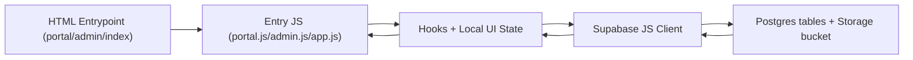

# Developer Documentation (Project-Specific)

This document is for the current runtime architecture in this repository snapshot.
It documents what exists now, not an idealized future architecture.

## 1. Project Overview (High-Level Mental Model)

### What this app does
- `public/portal.html` + `public/portal.js`: admin portal for auth, client creation/deletion, client status overview.
- `public/admin.html` + `public/admin.js`: content operations dashboard for one client at a time (upload media, publish article posts, publish logo kits, review/apply client edits, destructive cleanup).
- `public/index.html` + `public/app.js`: client-facing preview/review UI for `instagram`, `article`, and `logo` modes.

### How data flows

### How state is managed
- All state is component-local via `useState` and `useEffect`.
- No Redux, no Zustand, no Context store.
- Preview page splits state by concern:
  - Data fetching/mutations in `public/hooks/usePreviewData.js`
  - Derived UI projections in `public/hooks/usePreviewComputed.js`
  - Local note history in `public/hooks/useNotesHistory.js`
- Admin and portal keep very large local state in one file each (`public/admin.js`, `public/portal.js`).

### Architecture pattern used
- Multi-entry static app pattern:
  - three HTML entrypoints
  - each loads a Babel module script from `public/*.js`
  - import map resolves React and dependencies from CDN.
- Current data layer pattern is mixed:
  - `index/app` flow: partially hook-based.
  - `admin/portal` flow: direct Supabase access inside page file.

### How components are structured
- Public preview flow is split into composable sections:
  - `public/components/sections/*`
  - `public/components/cards/PostCard.js`
  - `public/components/logo/LogoKitPresentation.js`
  - shared visual tokens in `public/core/styles/App.styles.js`.
- Admin and portal UIs are monolithic files with many styled components and business functions in the same file.

### How routing works
- No React Router.
- Route selection is URL-level HTML entrypoint + query params:
  - `?client=<slug>` and `?mode=instagram|article|logo` parsed in `public/utils/appHelpers.js`.
- Vercel rewrites in `vercel.json` map clean paths (`/`, `/portal`, `/admin`, `/index`) and module paths to `/public/*`.

### How API calls are handled
- Supabase client created from `window.APP_CONFIG` in:
  - `public/services/supabaseClient.js` (preview)
  - inline `createSupabaseClient()` inside `public/admin.js` and `public/portal.js`.
- Queries and writes are done directly with `.from(...).select/insert/update/delete`.
- Storage uploads/removals use `client.storage.from(bucket)`.

### Where business logic lives
- Preview business logic:
  - grouping Instagram single/carousel/story/grid: `public/hooks/usePreviewComputed.js`
  - review mutation + local optimistic merge: `public/hooks/usePreviewData.js`
- Admin business logic:
  - upload payload shaping, typed title conventions, publish flows, delete flows: `public/admin.js`
- Portal business logic:
  - client feed lifecycle + polling + desktop notifications: `public/portal.js`

## 2. Folder & Architecture Breakdown

### `public/`
- Purpose: runtime app (HTML entrypoints + JS modules loaded in production).
- Must contain: deploy-served UI/runtime code and browser assets.
- Must NOT contain: experimental dead code not referenced by entrypoints.
- Examples:
  - `public/index.html`, `public/app.js`, `public/admin.js`, `public/portal.js`.
- Common mistakes:
  - adding imports to paths not rewritten in `vercel.json`.
  - mixing old and new duplicate components.

### `public/components/`
- Purpose: reusable UI pieces for preview flow.
- Must contain: presentation components with explicit props.
- Must NOT contain: Supabase query logic.
- Examples:
  - `public/components/sections/InstagramPreviewSection.js`
  - `public/components/cards/PostCard.js`
  - `public/components/logo/LogoKitPresentation.js`
- Common mistakes:
  - editing duplicate/unreferenced files:
    - `public/components/PostCard.js`
    - `public/components/LogoKitPresentation.js`
    - `public/components/CaptionBlock.js`
  - while runtime imports use `public/components/cards/*` and `public/components/logo/*`.

### `public/hooks/`
- Purpose: preview-page data and derived-state logic.
- Must contain: fetch/update logic and computed transforms for preview app.
- Must NOT contain: styled UI components.
- Examples:
  - `public/hooks/usePreviewData.js`
  - `public/hooks/usePreviewComputed.js`
  - `public/hooks/useNotesHistory.js`
- Common mistakes:
  - bypassing these hooks and adding direct fetch logic in `public/app.js`.

### `public/core/`
- Purpose: styling primitives and animations.
- Must contain: design system styles and animation keyframes.
- Must NOT contain: table query logic.
- Examples:
  - `public/core/styles/App.styles.js`
  - `public/core/animations.js`
- Common mistakes:
  - duplicating styled tokens in feature files instead of reusing core styles.

### `public/services/`
- Purpose: Supabase client setup.
- Must contain: client creation/cache logic only.
- Must NOT contain: table-specific query logic.
- Example:
  - `public/services/supabaseClient.js`.
- Common mistakes:
  - creating multiple new client factories in random files.

### `public/utils/`
- Purpose: pure helpers for parsing URL/title/meta and media-type decisions.
- Must contain: deterministic, side-effect-free utility logic.
- Must NOT contain: network/storage access.
- Example:
  - `public/utils/appHelpers.js`.

### `supabase/`
- Purpose: SQL schema and DB policies.
- Must contain: additive schema and policy definitions.
- Must NOT contain: destructive migration shortcuts for prod.
- Example:
  - `supabase/schema.sql`.

### `src/`
- Current status: legacy/non-runtime for deployed entrypoints.
- Why: production HTML entrypoints in `public/*.html` do not import `src/*`.
- Common mistakes:
  - editing `src/*` expecting production behavior changes.

### Component structure philosophy
- `public/app.js` composes small sections and injects `PostCard`/`LogoKitPresentation`.
- Section components are thin wrappers that map data to reusable card/presentation components.
- Admin/portal currently violate this philosophy by keeping UI + logic in one file.

### Reusability patterns
- Use shared helpers (`public/utils/appHelpers.js`) for title/type parsing.
- Use shared styles from `public/core/styles/App.styles.js`.
- Use reusable preview components from `public/components/cards/*` and `public/components/logo/*`.

### Separation of concerns strategy (current vs target)
- Current:
  - good separation in preview flow
  - weak separation in admin/portal.
- Practical target:
  - keep UI -> hook -> API-like boundaries by moving table calls out of `admin.js` and `portal.js`.

## 3. State Management Strategy

### Where global state lives
- There is no React global store.
- Cross-session/browser-global values:
  - `window.APP_CONFIG` from `public/config.js`.
- Cross-component persistent local state:
  - notes history in `localStorage` (`gymway_notes_history_v1_*`) via `public/hooks/useNotesHistory.js`.

### Where local state should live
- Screen-specific and ephemeral state stays in page entry module:
  - e.g. admin form buffers in `public/admin.js`.
- Shared preview data state belongs in hooks:
  - `usePreviewData`, `usePreviewComputed`, `useNotesHistory`.

### When to use `useState` vs `useReducer` vs Context
- Current codebase uses `useState` everywhere; keep this for small/medium feature additions.
- Use `useReducer` in this project when:
  - one component has 10+ interdependent fields and complex transitions.
  - best candidate is `public/admin.js` publish/edit flows.
- Use Context only for:
  - truly cross-tree state used by multiple branches of component tree.
  - current preview app does not need it yet.

### How async state is handled
- Fetch lifecycle pattern in preview:
  - `status: { loading, error, message }` in `usePreviewData`.
- Async mutation pattern:
  - set `savingId`
  - run Supabase update
  - patch local state
  - set success/error message.

### Caching strategy
- Supabase client instance is memo-cached in `public/services/supabaseClient.js`.
- Portal/admin do not share that cache function and each creates its own client in-file.
- Data caching is mostly none (live fetch + state memory + interval polling in portal every 15s).

### Derived state patterns
- Heavy derived projections are in `usePreviewComputed`:
  - post filtering by mode
  - Instagram feed grouping
  - counter stats and titles/subtitles.

### Anti-pattern warnings (from current code)
- Extremely large state surface in `public/admin.js` causes maintenance drag.
- Mixed concern state (view flags + server mutation state + upload buffers in one component).
- Duplicate component files can cause editing wrong file with no runtime effect.

## 4. Component Design Rules

### Naming conventions (current runtime)
- Hook names use `use*`.
- Component names use PascalCase.
- Helper functions are mostly verb-based (`parse...`, `strip...`, `build...`, `load...`).
- Be consistent with existing file naming in `public/`.

### Folder conventions
- New preview UI section: `public/components/sections/`.
- New reusable card/presentation: `public/components/cards/` or `public/components/logo/`.
- New preview data hook: `public/hooks/`.
- New shared helper: `public/utils/appHelpers.js` or new file in `public/utils/`.

### Smart vs dumb components
- Smart/data-aware:
  - `public/app.js`
  - `public/hooks/usePreviewData.js`.
- Dumb/presentational:
  - `public/components/sections/*`
  - `public/components/layout/AppPageLayout.js`.

### Props structuring rules
- Pass explicit props with stable names.
- Keep mutation callbacks explicit:
  - `onUpdateReview`, `onAppendHistory`, `onUpdateLogoKitReview`.
- Avoid passing raw Supabase client through deep component trees.

### When to lift state
- Lift when two sibling sections need same data or mutation callback.
- Example:
  - `app.js` owns `savingId` and passes it to both article and Instagram sections.

### Prevent prop drilling
- Current project pattern: section boundary props from `app.js`.
- If prop depth grows >2 levels, create a targeted hook in section parent instead of passing many low-level flags.

### Memoization strategy
- Existing memoization:
  - `useMemo` in `usePreviewComputed`.
  - `useMemo` in `admin.js` for parsed captions/mappings.
- Use memoization only for expensive transforms, not for basic scalar fields.

### Performance optimization approach
- Keep expensive grouping logic in hooks (`usePreviewComputed`).
- Keep UI list components keyed by stable IDs.
- Avoid recomputing media parsing in render loops.

### DO / DON'T examples
- DO:
  - add preview query in `public/hooks/usePreviewData.js`.
  - add derived projection in `public/hooks/usePreviewComputed.js`.
- DON'T:
  - add direct `.from('posts')` call inside `public/components/sections/InstagramPreviewSection.js`.
  - edit `public/components/PostCard.js` when runtime imports `public/components/cards/PostCard.js`.

## 5. Feature Development Guide (CRITICAL SECTION)

### How to correctly build a new feature in this project

1. Where to create files
- Preview user feature:
  - UI: `public/components/sections/`
  - Hook: `public/hooks/`
  - Utility: `public/utils/`
- Admin feature:
  - currently in `public/admin.js` (monolith); add helper functions near related flow blocks.
- Portal feature:
  - currently in `public/portal.js`.

2. How to structure logic
- For preview flow:
  - put DB calls and mutation logic in `usePreviewData`.
  - put grouping/count/title derivation in `usePreviewComputed`.
  - keep section components render-only.
- For admin/portal:
  - preserve existing function clusters:
    - load/auth functions near top
    - publish flows grouped
    - destructive flows grouped.

3. How to connect to API (Supabase)
- Use `createSupabaseClient()` from `public/services/supabaseClient.js` for preview.
- Admin/portal currently use local `createSupabaseClient()` wrappers based on `window.APP_CONFIG`.
- Keep query columns aligned with existing shape expectations.

4. How to handle state
- Add minimal state fields near existing related state.
- Keep status updates user-visible via `setStatus(...)`.
- For async writes, set `busy` or `savingId` before call and clear after.

5. How to integrate into routing
- If feature is preview-mode-specific:
  - respect `mode` query param parsing in `public/utils/appHelpers.js`.
- If adding new route entry:
  - add rewrite mapping in `vercel.json`.
  - add HTML+JS entrypoint under `public/`.

6. How to test manually
- Run server and smoke test:
  - `/portal.html`
  - `/admin.html`
  - `/index.html`
- Validate query-path behavior:
  - `/index.html?client=<slug>&mode=instagram`
  - `/index.html?client=<slug>&mode=article`
  - `/index.html?client=<slug>&mode=logo`
- Validate Supabase behaviors:
  - auth sign-in/out
  - one read query
  - one write update
  - one storage upload/remove if feature touches files.

7. Mistakes to avoid
- Editing `src/*` expecting runtime effect.
- Editing duplicate unused component files in `public/components/` root.
- Adding new imports without corresponding `vercel.json` rewrite if accessed from root path.
- Returning altered data shapes that break existing UI assumptions.

## 6. API Layer Documentation

### How API calls are structured (current reality)
- There is no dedicated `public/api/` layer in this branch snapshot.
- Calls are in:
  - `public/hooks/usePreviewData.js` (preview data)
  - `public/admin.js` (admin CRUD + storage)
  - `public/portal.js` (portal CRUD + auth + storage cleanup).

### Where they live
- Preview:
  - `clients`, `posts`, `logo_kits`, `logo_assets`, `logo_colors`, `logo_story_steps`.
- Admin:
  - heavy writes to `posts`, `logo_*` tables + storage bucket.
- Portal:
  - auth + `clients`, `posts`, storage cleanup + poll.

### Error handling pattern
- Supabase response checked inline:
  - `if (error) { setStatus(...); return; }`
- User feedback always string-based status messages.
- No centralized error translator or retry wrapper.

### Retry logic
- No explicit retry strategy.
- Only recurring refresh is portal interval polling (`15s`).

### Authentication flow
- Supabase auth with email/password:
  - `signInWithPassword`
  - `signOut`
  - `getSession`
  - `onAuthStateChange`.
- Implemented directly in `public/portal.js` and `public/admin.js`.

### Token storage strategy
- No manual token storage in code.
- Session persistence is handled by Supabase JS client internals.

### How to safely add new endpoints (table calls)
- Keep query + returned fields explicit.
- Keep existing status handling and setBusy/saving flags.
- For preview, prefer adding to `usePreviewData`.
- For admin/portal, add helper function wrappers near existing query clusters and keep response shape unchanged.

## 7. Styling System

### CSS strategy
- Styled-components is primary styling approach in JS modules.
- External global CSS constants loaded in each HTML from remote URLs.
- No Tailwind/CSS modules in runtime files.

### Global styles
- `createGlobalStyle` used in:
  - `public/core/styles/App.styles.js` (preview app)
  - `public/admin.js` (admin)
  - `public/portal.js` (portal).

### Theming approach
- Uses CSS variables from external constants and local overrides (`--panel`, `--accent`, etc.).
- Not using styled-components `ThemeProvider` in current runtime.

### Reusable UI components
- Preview reusable blocks:
  - `AppPageLayout`
  - section components
  - `PostCard`
  - `LogoKitPresentation`.
- Reusable style primitives are exported from `public/core/styles/App.styles.js`.

### Responsive strategy
- Grid breakpoints in styled-components (`@media` in styles).
- Instagram feed and card layouts adapt from 3 columns to 1.

## 8. Reusable Utilities & Custom Hooks

### `public/services/supabaseClient.js`
- What: creates and caches Supabase client from `window.APP_CONFIG`.
- Use when: preview-side data access.
- Do not use when: you need an admin/portal isolated factory with custom behavior.
- Example: `usePreviewData` calls `createSupabaseClient()` before queries.

### `public/utils/appHelpers.js`
- What: URL parsing, content-type parsing, Instagram meta decoding, media helpers.
- Use when: converting titles to semantic types and route mode/client extraction.
- Do not use when: performing DB writes or DOM effects.
- Example: `parseInstagramPreviewMeta(post)` groups carousel/story/grid in `usePreviewComputed`.

### `public/hooks/usePreviewData.js`
- What: fetches preview data and performs review mutations.
- Use when: page needs posts/logo kit data and updateReview actions.
- Do not use when: you only need pure derived formatting.
- Example: `updateReview(postId, changes, successMessage)` updates `posts` and merges local state.

### `public/hooks/usePreviewComputed.js`
- What: memoized derived view model for preview page.
- Use when: transforming raw posts into feed/story/grid counts and page copy.
- Do not use when: mutating server state.
- Example: constructs carousel groups and `savingKey`/`historyKey` values.

### `public/hooks/useNotesHistory.js`
- What: localStorage-based note history + paragraph-level diffing for article edits.
- Use when: storing client review trail locally.
- Do not use when: server-authoritative audit log is required.
- Example: `appendNoteHistory(postId, {beforeText, afterText}, 'Αλλαγή άρθρου')`.

## 9. Performance Optimization Notes

### Expensive renders
- `public/admin.js` is large with many state updates; many styled components and inline handlers re-evaluate frequently.
- `LogoKitPresentation` creates a large slide map and dynamic font-face injection.

### Memoization usage
- Good: `usePreviewComputed` uses `useMemo` for heavy grouping and counters.
- Risk: some large JSX maps still computed on each render in admin.

### Potential bottlenecks
- Portal polling every 15s (`loadPortalData`) can be costly with many clients/posts.
- Admin publish loops perform sequential uploads/inserts (safe but slow for large batches).
- Local large arrays in admin state can trigger broad rerenders.

### Suspense / lazy loading strategy
- None currently used.
- All modules load eagerly via Babel module scripts.

### Bundle optimization suggestions (non-breaking)
- Move admin helper logic to imported module files to reduce first-parse burden of `admin.js`.
- Remove duplicate unused files in `public/components/` root to reduce confusion and accidental imports.
- Consider prebuilding (instead of runtime Babel transform) for faster startup and fewer runtime parse costs.

## 10. Technical Debt & Improvement Suggestions

### Code smells
- Monolith files:
  - `public/admin.js` and `public/portal.js` combine UI, queries, mutations, formatting, and styles.
- Duplicated files:
  - `public/components/PostCard.js` vs `public/components/cards/PostCard.js`
  - `public/components/LogoKitPresentation.js` vs `public/components/logo/LogoKitPresentation.js`.

### Repetition
- Supabase client creation repeated in multiple entry files.
- Similar status/busy/error handling patterns repeated in admin and portal flows.

### Tight coupling
- UI components and Supabase table shapes are tightly coupled through direct query fields.
- Changing column names immediately breaks render code due to no adaptation layer.

### Over-engineering
- `admin.js` has many micro-helpers in one file with broad closure dependencies; hard to isolate for tests.

### Under-architecture
- No API module boundary in current runtime branch, despite prior plan to isolate Supabase calls.
- No test harness (unit/integration) for data transforms and destructive flows.

### Schema/runtime mismatch risk
- `usePreviewData` and `admin.js` query `logo_kits`, `logo_assets`, `logo_colors`, `logo_story_steps`.
- Current `supabase/schema.sql` in this branch does not define those logo tables.
- This is a production risk when provisioning new environments.

## 11. Quick Onboarding Cheat Sheet

### 15 rules I must follow
1. Treat `public/*.html` as production entrypoints.
2. Make behavior changes in `public/*`, not `src/*`.
3. Confirm route rewrites in `vercel.json` for any new top-level path.
4. Keep preview fetch logic in `public/hooks/usePreviewData.js`.
5. Keep preview derived logic in `public/hooks/usePreviewComputed.js`.
6. Keep pure parsing helpers in `public/utils/appHelpers.js`.
7. Reuse `public/core/styles/App.styles.js` before creating new style primitives.
8. Preserve existing Supabase field selections unless feature requires schema change.
9. Use `setStatus` messages for every async failure path.
10. For writes, always set/reset `busy` or `savingId`.
11. Validate `window.APP_CONFIG` dependency when adding new Supabase usage.
12. For storage changes, keep bucket handling aligned with `STORAGE_BUCKET` fallback (`post-photos`).
13. Prefer editing `public/components/cards/PostCard.js` and `public/components/logo/LogoKitPresentation.js` (runtime-used).
14. Smoke test `/portal.html`, `/admin.html`, `/index.html` before deploy.
15. Keep `supabase/schema.sql` aligned with runtime query tables.

### 10 red flags I must avoid
1. Adding direct table calls inside render-only section components.
2. Editing duplicate unused component files.
3. Changing query param names (`client`, `mode`) without full link-flow update.
4. Breaking title prefix conventions (`[IG]`, `[ARTICLE]`, `[LOGO]`) used by parsing.
5. Removing `client_id` filters from admin/preview queries.
6. Changing approval status string values (`pending`, `approved`, `disapproved`).
7. Shipping without checking Vercel rewrites.
8. Relying on `src/*` for production behavior.
9. Ignoring storage cleanup when deleting DB records with file paths.
10. Changing return object shape from hooks without updating consuming sections.

### 10 golden patterns already used in the codebase
1. Query-param driven mode/client selection in `appHelpers`.
2. Split fetch vs derived logic (`usePreviewData` + `usePreviewComputed`).
3. Explicit loading/error/message status object for preview.
4. Consistent Supabase error-first handling (`if (error) return`).
5. Local optimistic merge after update (`usePreviewData` post update mapping).
6. Local notes history with timestamped entries and diffs.
7. Reusable layout shell (`AppPageLayout`) wrapping global style + page container.
8. Section-based composition in `public/app.js`.
9. Storage upload then DB insert pattern in admin publish flows.
10. Defensive cleanup of object URLs in `useEffect` cleanup blocks.

